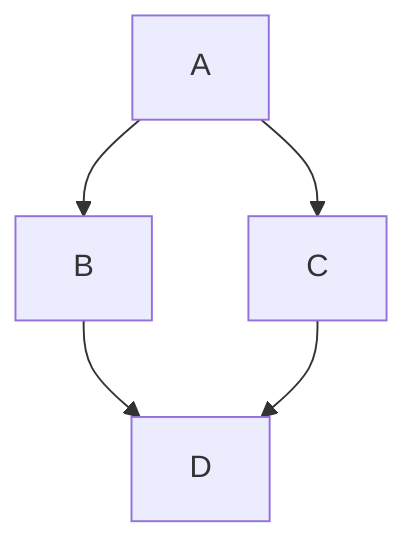

マークダウン記法の表示をテストしたり、CSS の実装内容を確認するページです。  

## 見出し 2 / Heading 2

テキストテキストテキストテキストテキストテキストテキストテキストテキストテキストテキストテキストテキストテキスト

### 見出し 3 / Heading 3

テキストが長いテキストが長いテキストが長いテキストが長いテキストが長いテキストが長いテキストが長いテキストが長いテキストが長いテキストが長いテキストが長いテキストが長いテキストが長いテキストが長いテキストが長いテキストが長いテキストが長いテキストが長いテキストが長いテキストが長いテキストが長いテキストが長いテキストが長いテキストが長いテキストが長いテキストが長いテキストが長いテキストが長いテキストが長いテキストが長いテキストが長いテキストが長い

#### 見出し 4 / Heading 4

テキストテキストテキストテキストテキストテキストテキストテキストテキストテキストテキストテキストテキストテキスト

##### 見出し 5 / Heading 5

テキストテキストテキストテキストテキストテキストテキストテキストテキストテキストテキストテキストテキストテキスト

###### 見出し 6 / Heading 6

テキストテキストテキストテキストテキストテキストテキストテキストテキストテキストテキストテキストテキストテキスト

## 改行

### 末尾にスペースなしで改行

テキストテキストテキストテキスト
テキストテキストテキストテキスト
テキストテキストテキストテキスト

### 末尾にスペースありで改行

テキストテキストテキストテキスト  
テキストテキストテキストテキスト  
テキストテキストテキストテキスト  

## 段落

空白行を挟むと段落になります。空白行を挟むと段落になります。空白行を挟むと段落になります。空白行を挟むと段落になります。空白行を挟むと段落になります。空白行を挟むと段落になります。

空白行を挟むと段落になります。空白行を挟むと段落になります。空白行を挟むと段落になります。空白行を挟むと段落になります。空白行を挟むと段落になります。空白行を挟むと段落になります。

## 装飾

*イタリック（アスタリスク1個）*

__ボールド（アンダースコア2個）__

~~取り消し線（チルダ2個）~~

~~*__組み合わせ__*~~

## リンク

[KeM's Clew](https://clew.kem198.net/)

## 画像の埋め込み

小さい画像 (532x532):


大きい画像 (1080x1080):


## テーブル

| あいうえお | かきくけこ |
| ---------- | ---------- |
| ねこ       | いぬ       |
| ねこ       | いぬ       |
| ねこ       | いぬ       |
| ねこ       | いぬ       |
| ねこ       | いぬ       |

| あいうえお | かきくけこ | さしすせそ |
| ---------- | ---------- | ---------- |
| ねこ       | いぬ       | ごりら     |
| ねこ       | いぬ       | ごりら     |
| ねこ       | いぬ       | ごりら     |
| ねこ       | いぬ       | ごりら     |
| ねこ       | いぬ       | ごりら     |

| 左寄せ左寄せ左寄せ | 中央寄せ中央寄せ中央寄せ | 右寄せ右寄せ右寄せ |
| :----------------- | :----------------------: | -----------------: |
| ねこ               |           いぬ           |             ごりら |
| ねこ               |           いぬ           |             ごりら |
| ねこ               |           いぬ           |             ごりら |
| ねこ               |           いぬ           |             ごりら |
| ねこ               |           いぬ           |             ごりら |

間にテキスト

| あいうえお | かきくけこ | さしすせそ | コンテンツが長いコンテンツが長いコンテンツが長いコンテンツが長いコンテンツが長いコンテンツが長いコンテンツが長い |
| ---------- | ---------- | ---------- | ---------------------------------------------------------------------------------------------------------------- |
| ねこ       | いぬ       | ごりら     | コンテンツが長いコンテンツが長いコンテンツが長いコンテンツが長いコンテンツが長いコンテンツが長いコンテンツが長い |
| ねこ       | いぬ       | ごりら     | コンテンツが長いコンテンツが長いコンテンツが長いコンテンツが長いコンテンツが長いコンテンツが長いコンテンツが長い |
| ねこ       | いぬ       | ごりら     | コンテンツが長いコンテンツが長いコンテンツが長いコンテンツが長いコンテンツが長いコンテンツが長いコンテンツが長い |
| ねこ       | いぬ       | ごりら     | コンテンツが長いコンテンツが長いコンテンツが長いコンテンツが長いコンテンツが長いコンテンツが長いコンテンツが長い |
| ねこ       | いぬ       | ごりら     | コンテンツが長いコンテンツが長いコンテンツが長いコンテンツが長いコンテンツが長いコンテンツが長いコンテンツが長い |

| データ型 | バイト数           | 全角文字 | 文字数 | 文字列の形式 |
| -------- | ------------------ | -------- | ------ | ------------ |
| CHAR     | 半角 1 / 全角 2    | 非推奨   | 固定   | 固定長文字列 |
| VARCHAR  | 半角 1 / 全角 2    | 非推奨   | 可変   | 可変長文字列 |
| NCHAR    | 半角・全角ともに 2 | 推奨     | 固定   | 固定長文字列 |
| NVARCHAR | 半角・全角ともに 2 | 推奨     | 可変   | 可変長文字列 |

## 水平線

ハイフン3つ

---

アンダースコア3つ

___

アスタリスク3つ

***

## 引用

> テキスト
>
> テキストテキストテキストテキストテキストテキストテキストテキストテキストテキストテキストテキストテキストテキストテキストテキストテキストテキストテキストテキストテキストテキスト
> テキストテキストテキストテキストテキストテキストテキストテキストテキストテキストテキストテキストテキストテキストテキストテキストテキストテキストテキストテキストテキストテキスト
> テキストテキストテキストテキストテキストテキストテキストテキストテキストテキストテキストテキストテキストテキストテキストテキストテキストテキストテキストテキストテキストテキスト

間にテキスト

> テキストテキストテキストテキストテキストテキストテキストテキストテキストテキストテキストテキストテキストテキストテキストテキストテキストテキストテキストテキストテキストテキスト
>
> テキストテキストテキストテキストテキストテキストテキストテキストテキストテキストテキストテキストテキストテキストテキストテキストテキストテキストテキストテキストテキストテキスト
>
> 引用引用引用引用引用
>> 二重引用二重引用二重引用二重引用二重引用
>> 二重引用二重引用二重引用二重引用二重引用
>> 二重引用二重引用二重引用二重引用二重引用
> 引用引用引用引用引用

## リスト

### 箇条書きリスト

- 箇条書きリスト
- 箇条書きリスト
    - 箇条書きリスト
    - 箇条書きリスト
        - 箇条書きリスト
        - 箇条書きリスト
    - 箇条書きリスト
- 箇条書きリスト

- コンテンツが長いコンテンツが長いコンテンツが長いコンテンツが長いコンテンツが長いコンテンツが長いコンテンツが長いコンテンツが長いコンテンツが長いコンテンツが長いコンテンツが長いコンテンツが長いコンテンツが長いコンテンツが長いコンテンツが長い
- コンテンツが長いコンテンツが長いコンテンツが長いコンテンツが長いコンテンツが長いコンテンツが長いコンテンツが長いコンテンツが長いコンテンツが長いコンテンツが長いコンテンツが長いコンテンツが長いコンテンツが長いコンテンツが長いコンテンツが長い
    - コンテンツが長いコンテンツが長いコンテンツが長いコンテンツが長いコンテンツが長いコンテンツが長いコンテンツが長いコンテンツが長いコンテンツが長いコンテンツが長いコンテンツが長いコンテンツが長いコンテンツが長いコンテンツが長いコンテンツが長い
        - コンテンツが長いコンテンツが長いコンテンツが長いコンテンツが長いコンテンツが長いコンテンツが長いコンテンツが長いコンテンツが長いコンテンツが長いコンテンツが長いコンテンツが長いコンテンツが長いコンテンツが長いコンテンツが長いコンテンツが長い

### 番号付きリスト

1. 番号付きリスト
2. 番号付きリスト
    1. 番号付きリスト
    2. 番号付きリスト
        1. 番号付きリスト
        2. 番号付きリスト
    3. 番号付きリスト
3. 番号付きリスト

### チェックリスト

- [ ] チェックリスト
- [ ] チェックリスト
    - [ ] チェックリスト
    - [ ] チェックリスト
        - [ ] チェックリスト
        - [ ] チェックリスト
    - [x] チェックリスト
- [x] チェックリスト

## コード

### コードスパン

文章の中に `printf("Hello, World!\n");` を埋め込みます。  
文章の中に `printf("Hello, World!\n");` を埋め込みます。  
文章の中に `printf("Hello, World!\n");` を埋め込みます。

### コードブロック

無指定（`plaintext`）

```
abcdefABCDEF
0123456789
あいうえおアイウエオ
漢字漢字漢字
```

`text`

```text
abcdefABCDEF
0123456789
あいうえおアイウエオ
漢字漢字漢字
```

`shell`

```shell
# shell
$ cd
$ git clone https://github.com/kem198/dotfiles.git
$ source ~/dotfiles/.setup/Linux/setup.sh
```

`c`

```c
// C
#include <stdio.h>

int main(void) {
    printf("Hello, World!\n");
}
```

`sql`

```sql
-- SQL
SELECT TOP 99999999
    t.column_A,
    t.column_B,
    CASE WHEN t.column_C IS NULL THEN 'NULL' ELSE 'NOT NULL' END AS column_C,
    COUNT(*) AS cnt
FROM
    [tb] t -- ★テーブル名を指定
GROUP BY
    ROLLUP((
        t.column_A,
        t.column_B,
        CASE WHEN t.column_C IS NULL THEN 'NULL' ELSE 'NOT NULL' END
    ))
ORDER BY
    column_A,
    column_B,
    column_C
;
```

### コードブロック (Mermaid)



## 絵文字

🧶

---

以上。
